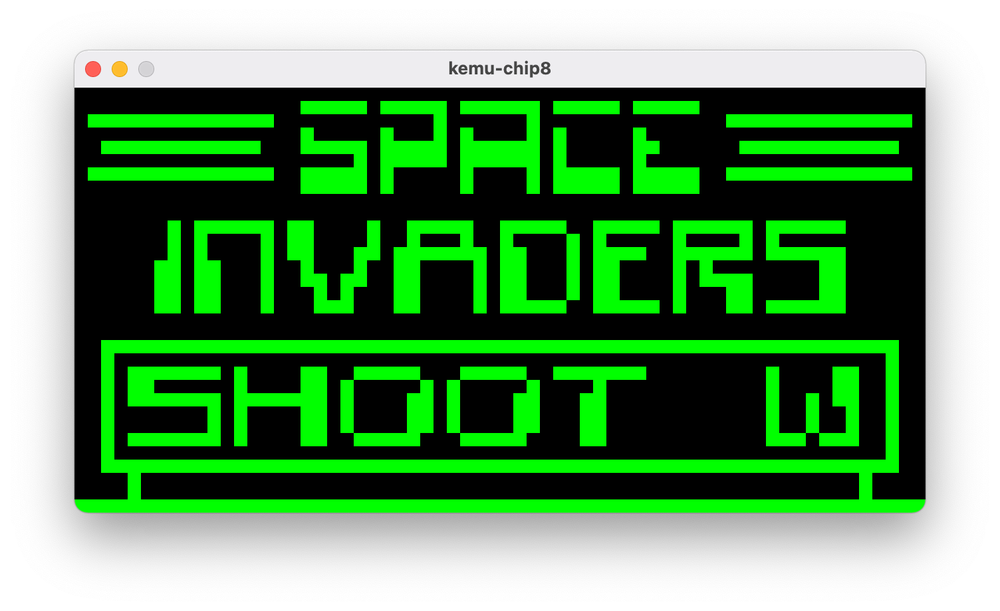
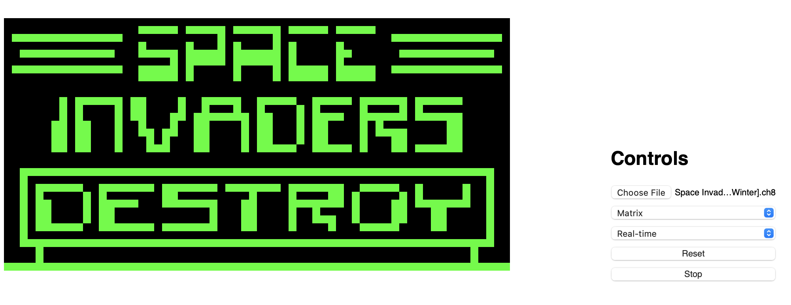

kemu-chip8
==========

This repo holds a quick and dirty emulator project. It targets the CHIP-8 instruction set, and is
written in Kotlin.

The goal is to write as much common Kotlin code as possible (not relying on a specific platform),
and provide at least two platform implementations.

Why?
----
Why not?

Platforms
---------

### JVM

This is a desktop, cross-platform, Swing-based CHIP-8 emulator.



```shell
./gradlew app-chip8-desktop:run
```

### JavaScript

This is a web-based version of the CHIP-8 emulator.



```shell
./gradlew app-chip8-browser:browserProductionRun
```